<!-- README.md is generated from README.Rmd. Please edit README.Rmd and run `rmarkdown::render("README.Rmd")`. -->

# whopals

This package brings the official [WHO Data Design
Language](https://srhdteuwpubsa.z6.web.core.windows.net/gho/data/design-language/design-system/colors/)
colours into R. Install it using:

``` r
pak::pak("finlaycampbell/whopals")
```

Palettes are exposed as `whopals::pal_*` functions. Use the `theme`
argument to specify a light or dark theme, `component` to specify the
plot component such as text or base, and `variant` to select a palette
variant where available. The available palettes are displayed below.

------------------------------------------------------------------------

**`pal_region()`**

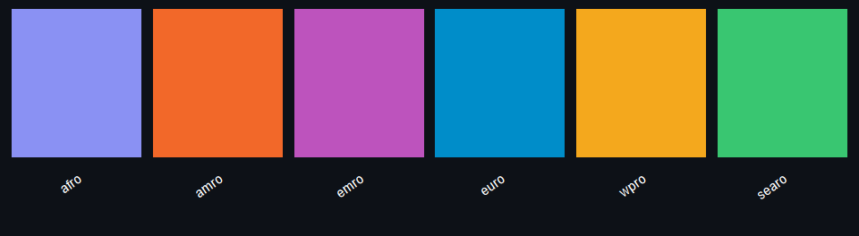<!-- -->

**`pal_trend()`**

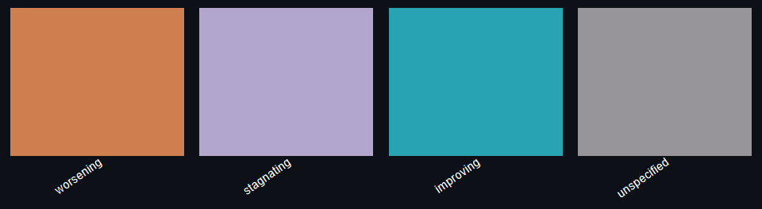<!-- -->

**`pal_gender()`**

<!-- -->

**`pal_category()`**

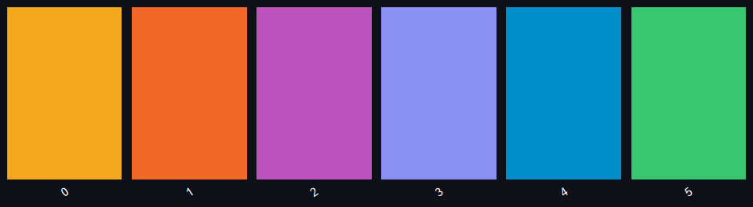<!-- -->

**`pal_sequential("brand")`**

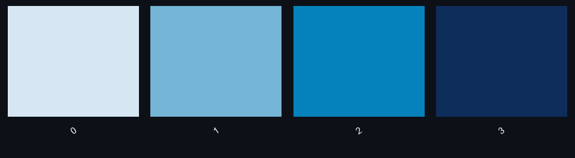<!-- -->

**`pal_sequential("complementary")`**

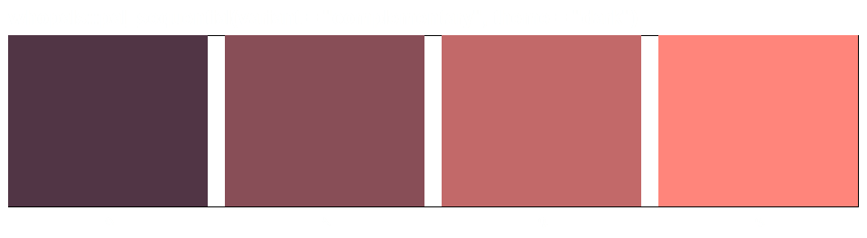<!-- -->

**`pal_sequential("colorful")`**

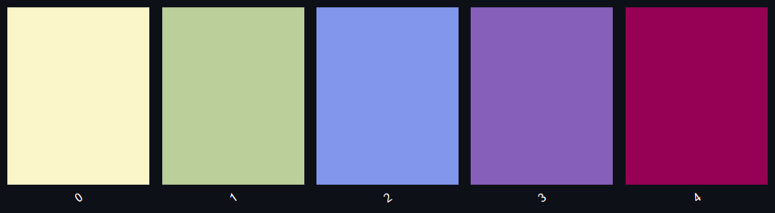<!-- -->

**`pal_diverging("base")`**

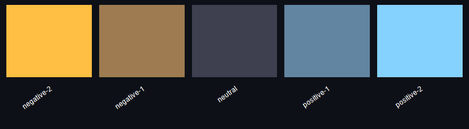<!-- -->

**`pal_diverging("alt")`**

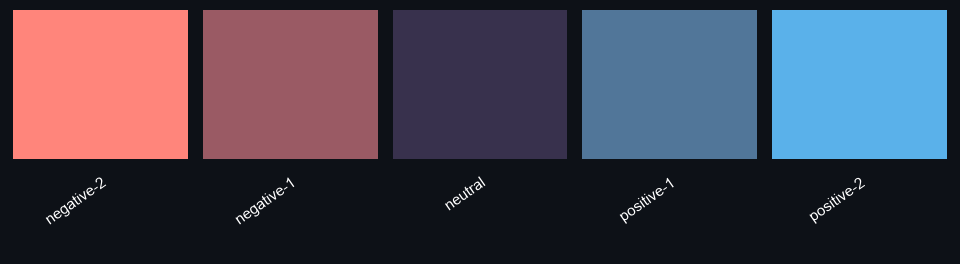<!-- -->

**`pal_brand()`**

<!-- -->

**`pal_foreground()`**

<!-- -->

**`pal_background()`**

<!-- -->

**`pal_text()`**

<!-- -->

**`pal_functional()`**

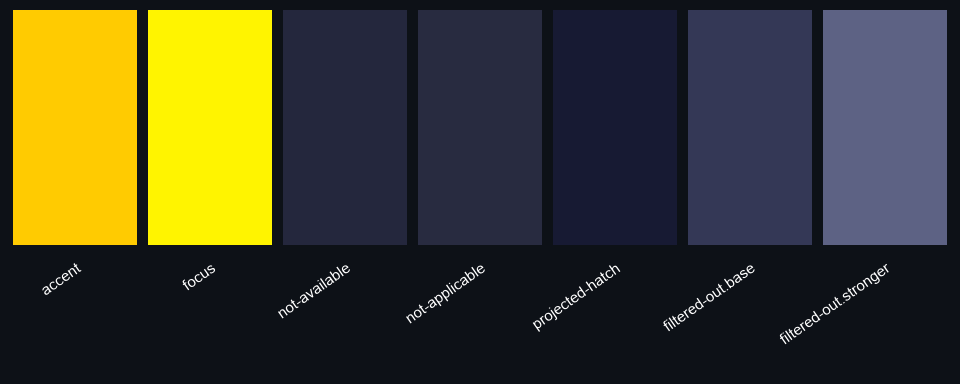<!-- -->

**`pal_selection()`**

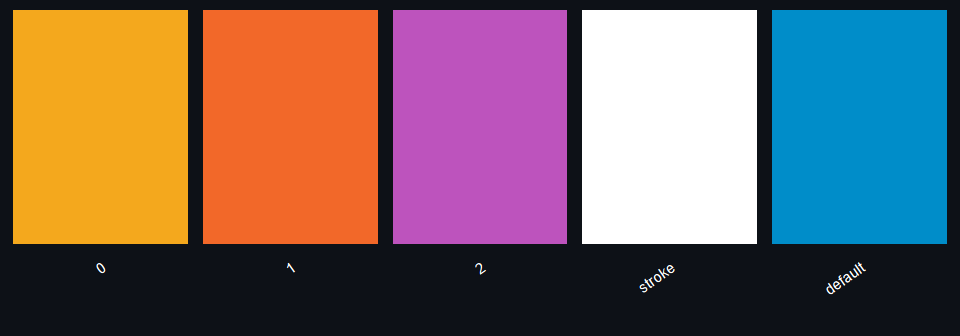<!-- -->

## Example column chart

The snippets below build a simple column chart of random values by WHO
region: **`pal_background()`** for the plot and panel fills,
**`pal_foreground()`** for axis titles and grid lines, **`pal_text()`**
for axis tick labels, **`pal_brand()`** for the title, and
**`pal_region()`** for bar fills. One figure uses **`theme = "dark"`**
throughout; the other uses **`theme = "light"`**.

``` r
library(whopals)
library(ggplot2)
set.seed(42)
df_regions <- data.frame(
  who_region = c("afro", "amro", "emro", "euro", "searo", "wpro"),
  value = round(runif(6L, 8, 40), 1),
  stringsAsFactors = FALSE
)
```

``` r
reg_dark <- whopals::pal_region(theme = "dark")
df_dark <- df_regions
df_dark$who_region <- factor(df_dark$who_region, levels = names(reg_dark))

ggplot(df_dark, aes(x = who_region, y = value, fill = who_region)) +
  geom_col(width = 0.72) +
  scale_fill_manual(values = reg_dark) +
  labs(title = "Illustrative values by WHO region", x = NULL, y = "Value") +
  theme_minimal(base_size = 12) +
  theme(
    legend.position = "none",
    plot.background = element_rect(
      fill = whopals::pal_background("base", "dark")[["base"]],
      color = NA
    ),
    panel.background = element_rect(
      fill = whopals::pal_background("weaker", "dark")[["weaker"]],
      color = NA
    ),
    plot.title = element_text(
      color = whopals::pal_brand("base", "dark")[["base"]],
      face = "bold",
      size = 14
    ),
    axis.title = element_text(
      color = whopals::pal_foreground("weaker", "dark")[["weaker"]]
    ),
    axis.text = element_text(
      color = whopals::pal_text("base", "dark")[["base"]]
    ),
    axis.text.x = element_text(angle = 28, hjust = 1, vjust = 1),
    panel.grid.major.x = element_blank(),
    panel.grid.minor = element_blank(),
    panel.grid.major.y = element_line(
      color = alpha(whopals::pal_foreground("weakest", "dark")[["weakest"]], 0.4)
    )
  )
```

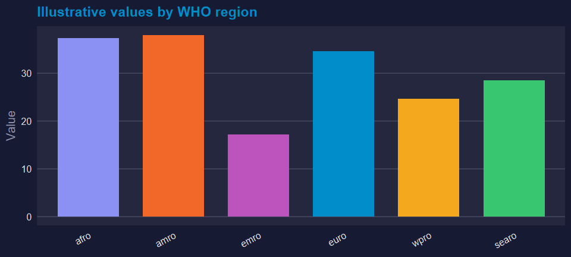<!-- -->

``` r
reg_light <- whopals::pal_region(theme = "light")
df_light <- df_regions
df_light$who_region <- factor(df_light$who_region, levels = names(reg_light))

ggplot(df_light, aes(x = who_region, y = value, fill = who_region)) +
  geom_col(width = 0.72) +
  scale_fill_manual(values = reg_light) +
  labs(title = "Illustrative values by WHO region", x = NULL, y = "Value") +
  theme_minimal(base_size = 12) +
  theme(
    legend.position = "none",
    plot.background = element_rect(
      fill = whopals::pal_background("base", "light")[["base"]],
      color = NA
    ),
    panel.background = element_rect(
      fill = whopals::pal_background("weaker", "light")[["weaker"]],
      color = NA
    ),
    plot.title = element_text(
      color = whopals::pal_brand("base", "light")[["base"]],
      face = "bold",
      size = 14
    ),
    axis.title = element_text(
      color = whopals::pal_foreground("weaker", "light")[["weaker"]]
    ),
    axis.text = element_text(
      color = whopals::pal_text("base", "light")[["base"]]
    ),
    axis.text.x = element_text(angle = 28, hjust = 1, vjust = 1),
    panel.grid.major.x = element_blank(),
    panel.grid.minor = element_blank(),
    panel.grid.major.y = element_line(
      color = alpha(whopals::pal_foreground("weakest", "light")[["weakest"]], 0.35)
    )
  )
```

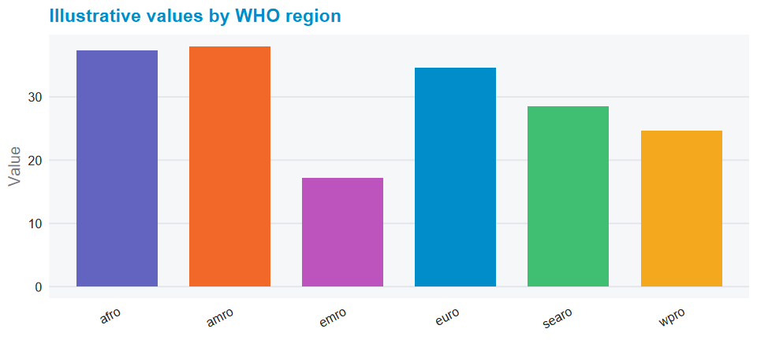<!-- -->
