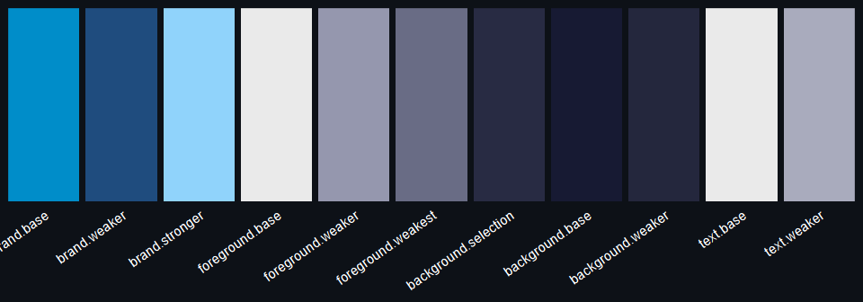
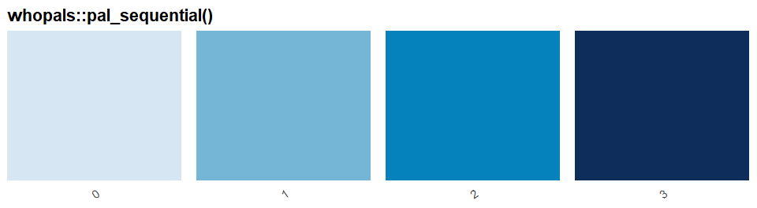
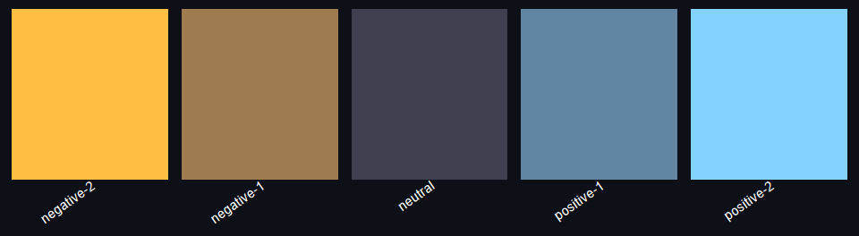

<!-- README.md is generated from README.Rmd. Please edit README.Rmd and run `rmarkdown::render("README.Rmd")`. -->

# whopals

**whopals** turns the colour definitions from the [WHO Data Design
Language —
Colours](https://srhdteuwpubsa.z6.web.core.windows.net/gho/data/design-language/design-system/colors/)
into plain R: named hex vectors and small accessor functions so you can
use the same themes, categories, regions, sequential and diverging
scales, and functional colours in **ggplot2**, **highcharter**, or any
other R graphics without hand-copying values from the site. Values are
embedded from WHO design tokens (see `data-raw/build_whopals_colors.R`
and `R/colors.R`).

## Installation

``` r
pak::pak("finlaycampbell/whopals")
```

After `library(whopals)`, use `whopals::pal_theme()`,
`whopals::pal_category()`, `whopals::pal_region()`,
`whopals::pal_sequential()`, `whopals::pal_diverging()`,
`whopals::pal_functional()`, `whopals::pal_gender()`, and
`whopals::pal_trend()` (the `whopals::` prefix is optional once the
package is attached). Defaults for each function match the plots below.

### Arguments by palette

**`pal_theme()`**

- **theme**: light, dark

**`pal_category()`**

- **component**: base, stronger, text
- **theme**: light, dark
- **include_other**: TRUE, FALSE

**`pal_region()`**

- **component**: base, text
- **theme**: light, dark

**`pal_sequential()`**

- **variant**: brand, complementary, colorful
- **component**: base, secondary (when **variant** is brand or
  complementary); base, alt (when **variant** is colorful)
- **theme**: light, dark
- **n**: NULL (discrete token stops) or an integer ≥ 2 (CIELAB
  interpolation length)

**`pal_diverging()`**

- **component**: base, alt
- **theme**: light, dark
- **n**: NULL (five stops) or an integer ≥ 2 (interpolated length)

**`pal_functional()`**

- **theme**: light, dark

**`pal_gender()`**

- **theme**: light, dark

**`pal_trend()`**

- **component**: base, text, both
- **theme**: light, dark

The plots below use **default** arguments only,
e.g. `whopals::pal_gender()` matches
`whopals::pal_gender(theme = "light")`.

## `whopals::pal_theme()`

<!-- -->

## `whopals::pal_category()`

<!-- -->

## `whopals::pal_region()`

<!-- -->

## `whopals::pal_sequential()`

<!-- -->

## `whopals::pal_diverging()`

<!-- -->

## `whopals::pal_functional()`

<!-- -->

## `whopals::pal_gender()`

<!-- -->

## `whopals::pal_trend()`

<!-- -->
