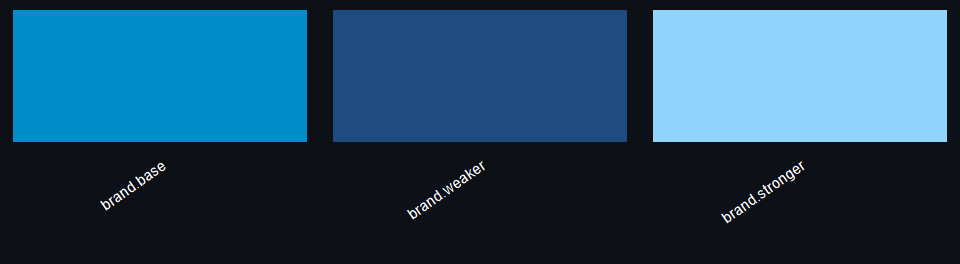
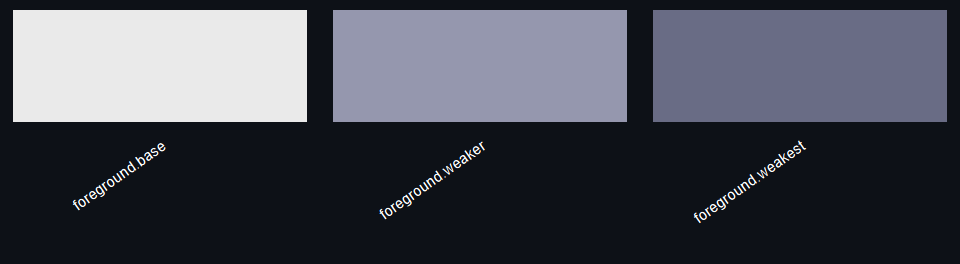
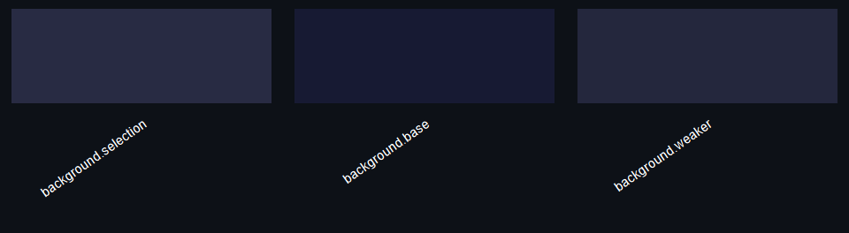
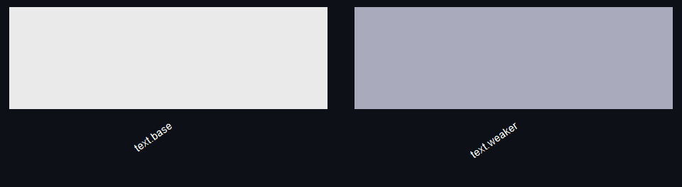

<!-- README.md is generated from README.Rmd. Please edit README.Rmd and run `rmarkdown::render("README.Rmd")`. -->

# whopals

This package brings the official [WHO Data Design
Language](https://srhdteuwpubsa.z6.web.core.windows.net/gho/data/design-language/design-system/colors/)
colours into R. Install it using:

``` r
pak::pak("finlaycampbell/whopals")
```

Palettes are exposed as `whopals::pal_*` functions. Use the `theme`
argument to specify a light or dark theme, `component` to specify the
plot component such as text or base, and `variant` to select a palette
variant where available. The available palettes are displayed below.

------------------------------------------------------------------------

**`pal_category()`**

<!-- -->

**`pal_region()`**

<!-- -->

**`pal_sequential("brand")`**

<!-- -->

**`pal_sequential("complementary")`**

<!-- -->

**`pal_sequential("colorful")`**

<!-- -->

**`pal_diverging()`**

<!-- -->

**`pal_functional()`**

<!-- -->

**`pal_gender()`**

<!-- -->

**`pal_trend()`**

<!-- -->

**`pal_selection()`**

<!-- -->

**`pal_theme("brand")`**

<!-- -->

**`pal_theme("foreground")`**

<!-- -->

**`pal_theme("background")`**

<!-- -->

**`pal_theme("text")`**

<!-- -->
